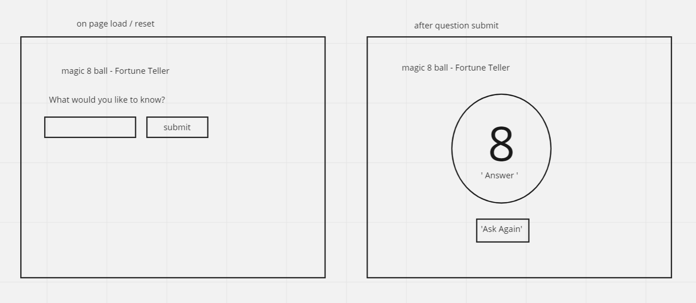

# Magic 8 Ball Plan

## HTML

-   h1 for header
-   section with

*   p tag for prompt
*   text input for user question
*   button for submit

-   section with

*   img of 8 ball
*   p tag to display the randomly selected answer
*   button to ask again

## EVENTS

-   button click (question submit)
-   hide prompt
-   display the image
-   pick a random number between 0 and the length of the answers array -1
-   set the content of the answer p to the random choice
-   button click (ask again)
-   hide 8 ball and the answer
-   show prompt
